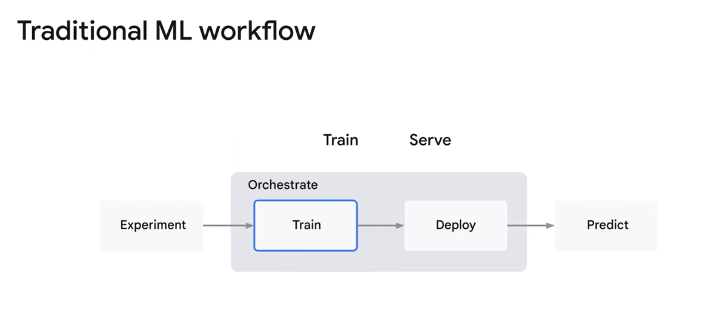
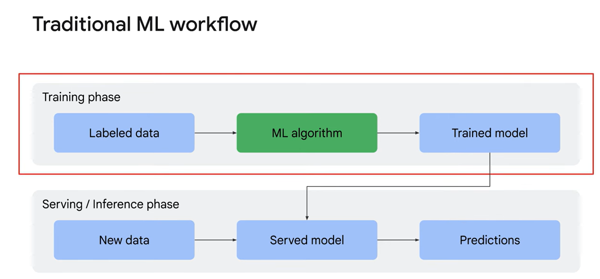

# Machine Learning Operations (MLOps) for Generative AI

## MLOps 演變
1. **MLOps 是甚麼?**：MLOps 是一組標準化流程與技術基礎設施，幫助企業快速且可靠地建立、部署與運行機器學習系統。為了解決模型訓練和部署過程繁瑣、耗時的問題，MLOps 提供了必要的工具與流程支持。

2. **非生成式 AI 與生成式 AI 的區別**：
   - **非生成式 AI（predictive AI）**：專注於解決特定任務，利用現有數據和演算法進行預測、分類或決策（如回歸、分類、物件檢測等）。
   - **生成式 AI(geneerative AI)**：能夠基於數據模式創造新的內容，如文字、圖像或音樂。生成式 AI 利用深層學習模型生成高度類似人類的輸出。

3. **擴展 MLOps 以支持生成式 AI**：
   - 生成式 AI 引入了一系列新挑戰，因此需在現有 MLOps 基礎上進行調整和改進，以便有效管理生成式 AI 系統並發揮其潛力。

4. **傳統 ML 工作流程的主要階段**：
   - **訓練階段**：包含實驗階段，主要利用標籤數據、ML 演算法和訓練模型來操作訓練步驟。
   - **服務（推論）階段**：模型部署到端點後接收推論請求，生成預測。

5. **四個關鍵階段**：
   - 傳統 ML 工作流程可分為 **實驗、訓練、部署、預測** 四大階段。

6. **評估與監控的引入**：
   - 隨著數據和應用需求不斷變化，評估和監控成為整個工作流程中的關鍵，幫助 MLOps 團隊持續檢視和調整模型。

7. **產業實踐：工件與數據治理**：
   - 在 ML 系統中管理多樣的工件，包括模型、特徵和管線的有向無環圖（DAG）。同時，持續在訓練和服務全生命周期中實施數據和工件治理。

8. **進階 MLOps 準備**：
   - 隨著生成式 AI 模型部署和管理的需求增長， MLOps 團隊需處理生成式 AI 的獨特挑戰，並學習如何運用 Vertex AI 等工具來應對這些挑戰。

## 生成式 AI 的 MLOps 重點整理

1. **定義**：生成式 AI 的 MLOps 擴展了傳統 MLOps 的原則，專為管理生成式 AI 應用而設計，加入了獨特的考量因素以應對其特有的需求。

2. **核心工作流程的強化**：
   - **實驗階段**：
     - **預訓練模型發掘**：重點轉向利用預訓練模型，而非從頭建立模型。
     - **直接預測捷徑**：允許透過自然語言提示直接進行預測，省去傳統模型構建的繁複過程。

3. **訓練與模型部署的調整**：
   - **自訂化與微調**：生成式 AI 更注重自訂與微調預訓練模型以滿足特定任務需求，而不是完整訓練模型，藉此提升現有模型的效能。
   - **精選數據**：生成式 AI 偏好精選數據集，而非大量標記數據，這需要調整數據儲存策略（如數據湖、數據倉儲）以確保有關數據隨時可用。

4. **治理工件階段**：
   - 引入新的工件，例如 **微調任務、自適應層和嵌入層**，這些工件需要有效治理以支持生成式 AI 的需求。

5. **評估與監控**：
   - 傳統評估指標（如準確率、精確率）可能不適用於生成式 AI，新的評估指標需要考慮 **語言流暢度、真實性及品牌形象**。
   - 可參閱 Vertex AI 的文件，了解專為生成式 AI 評估而設的新指標及服務。

6. **整合額外數據**：
   - 生成式 AI 模型通常較為靜態，受限於預訓練時所獲取的知識。
   - **外部數據的整合**能增強模型能力，但同時引入新的監控挑戰，使整體評估更加複雜。

7. **工具與資源**：
   - Vertex AI 提供的工具與策略，專為簡化生成式 AI 的 MLOps 流程而設計，協助進行模型自訂化、評估、監控及數據整合。

