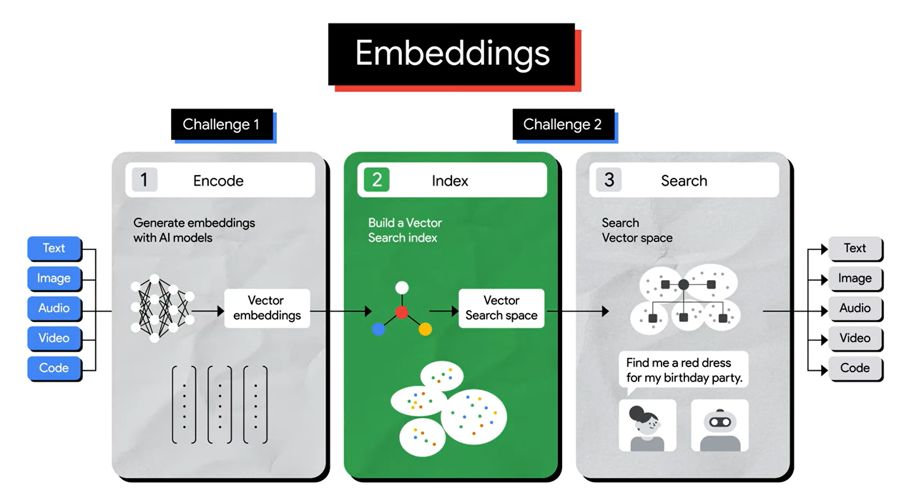
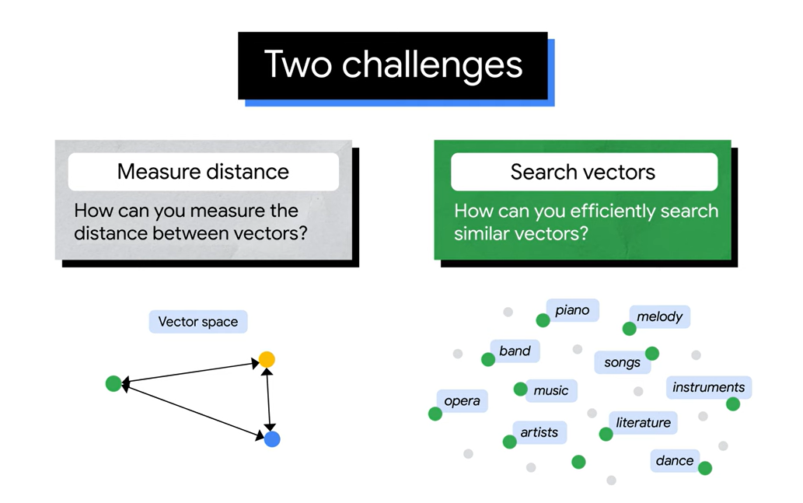
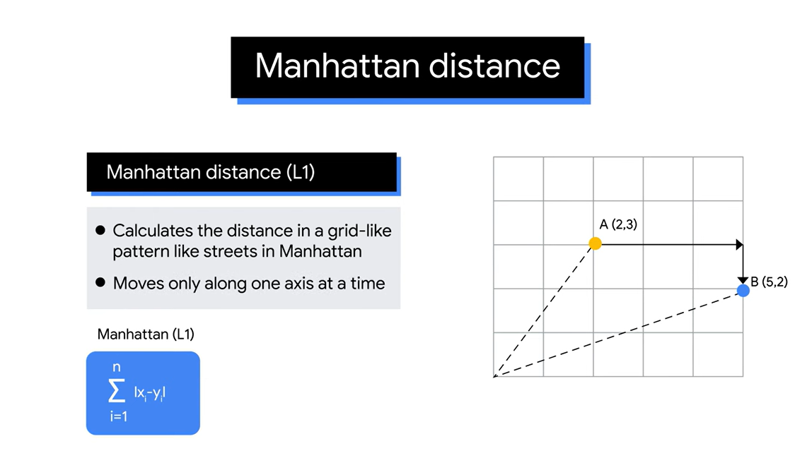
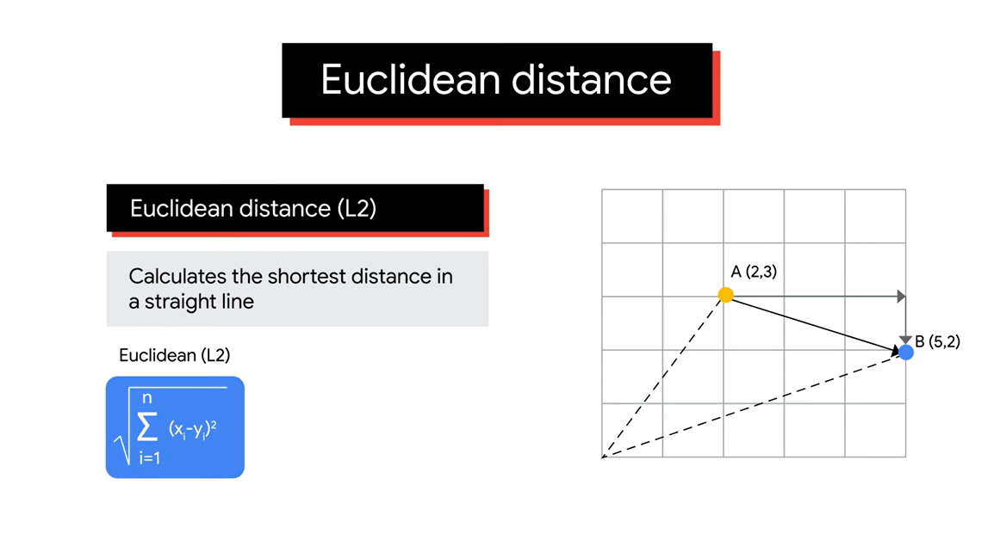
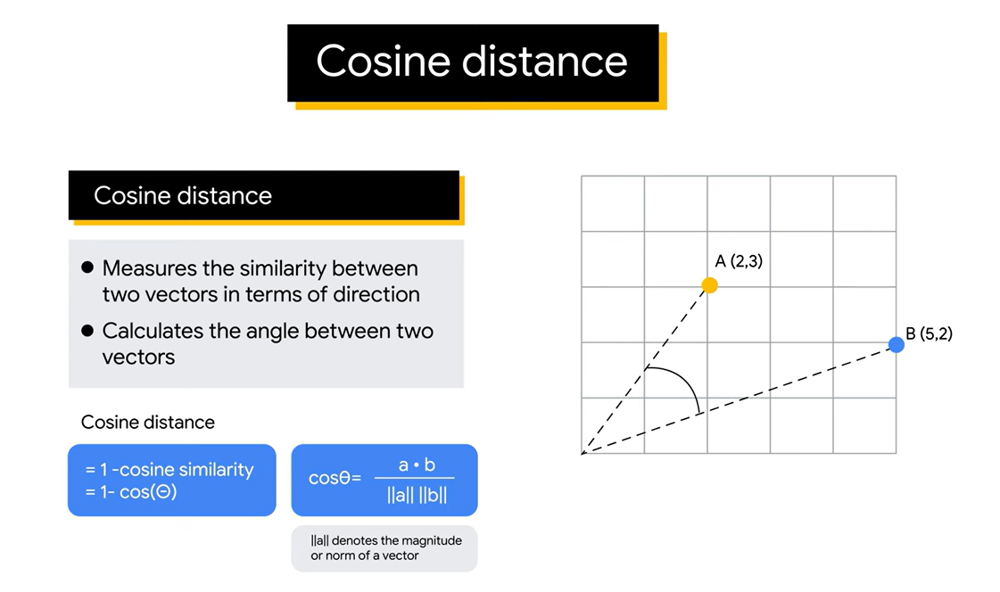
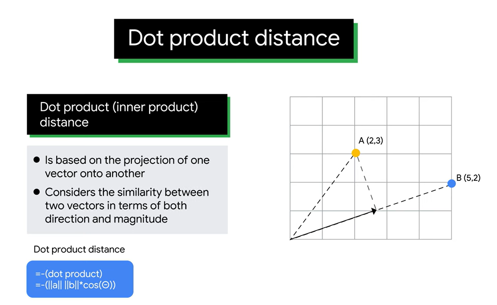
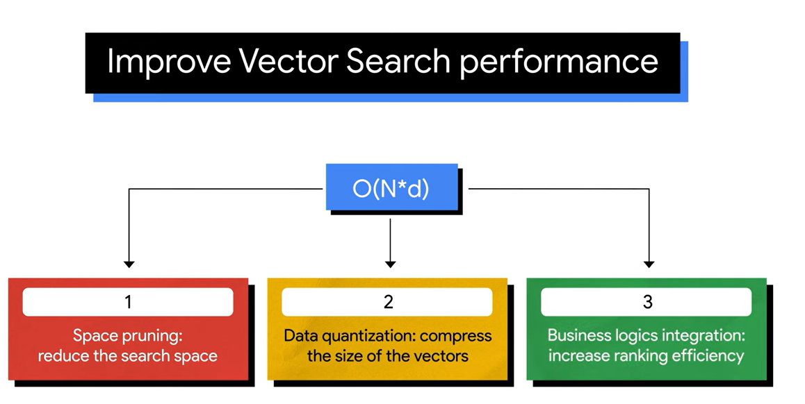
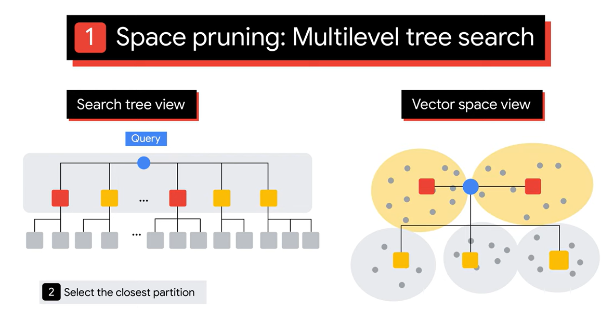
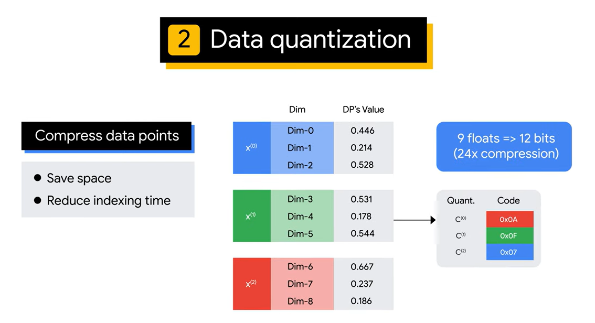
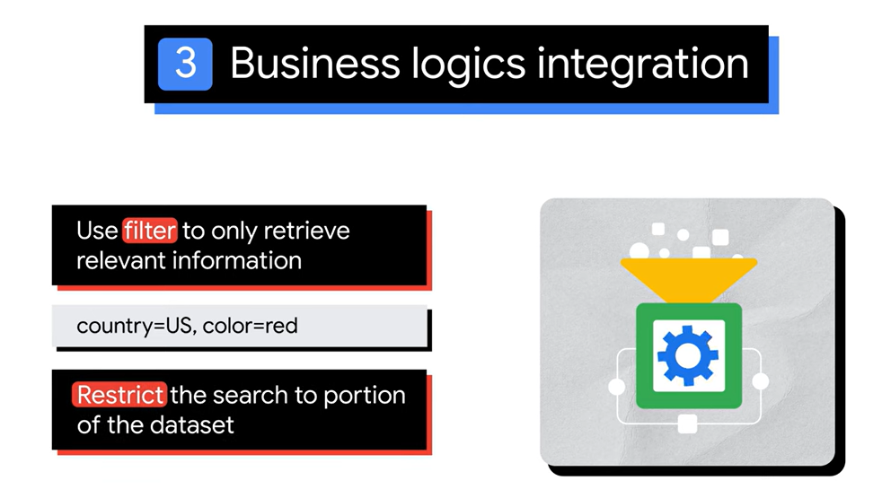

https://youtu.be/FhnjIWf0dG8

以下是關於向量搜索（Vector Search）的重點整理：

1. **向量索引的建立**：
   - 準備好嵌入（embeddings）後，接下來需要創建索引。
   - 向量搜索的挑戰在於如何索引向量空間，以便快速高效地進行搜索。

2. **向量距離測量的挑戰**：
   - 需要考慮如何衡量向量之間的距離，以確定它們的相對位置。
   - 常見的距離測量方法有四種，選擇取決於嵌入模型：
     - **曼哈頓距離（Manhattan distance）**：計算兩點在網格中沿各坐標的絕對差的總和。
     - **歐幾里得距離（Euclidean distance）**：計算兩點之間的直線最短距離。
     - **餘弦距離（Cosine distance）**：根據向量之間的角度測量相似度。
     - **點積距離（Dot product distance）**：考慮向量的方向和大小。

3. **高效查找相似向量的挑戰**：
   - 兩種廣泛使用的搜索算法：
     - **暴力搜尋（Brute-force）**：準確但計算成本高。
     - **TreeAh算法**：基於近似樹搜索的技術，適合大規模環境。
   - 暴力搜尋的三個步驟：
     1. 計算查詢向量與其他向量的距離。
     2. 對距離進行排序。
     3. 找到前k個最近的向量。

4. **TreeAh算法的加速搜索**：
   - TreeAh使用的近似最近鄰（Approximate Nearest Neighbor, ANN）技術可實現快速且可擴展的搜尋。
       - dividing the search space into multiple spaces
       - indexing the spaces using a tree structure
       - trading some accuracy for a significant speed-up  
   - Google Research在2020年推出的ScaNN（可擴展近似最近鄰算法）是業界最佳的ANN算法之一。

5. **ScaNN提高向量搜索性能的方式**：
   - **搜索複雜度**：O(N*d)，N為向量數量，d為維度。
       - 
   - **降低搜索空間**：通過多層次樹形結構進行空間修剪。
       - The red squares represent vector spaces that are close to the query, while the yellow squares indicate the spaces that are far from the query and will then be pruned.
       - 
   - **數據量化**：壓縮數據點以節省空間和縮短索引時間。
       - 
   - **整合業務邏輯**：限制搜索到相關數據的部分。
       -  

6. **Vertex AI向量搜索**：
   - 基於ScaNN的進階版本，提供全面管理的相似性向量搜索服務。
   - 2021年以Matching Engine的名義推出，提供快速搜索、低延遲及可擴展到數十億向量的功能，並且成本比同類服務低30%至50%。
