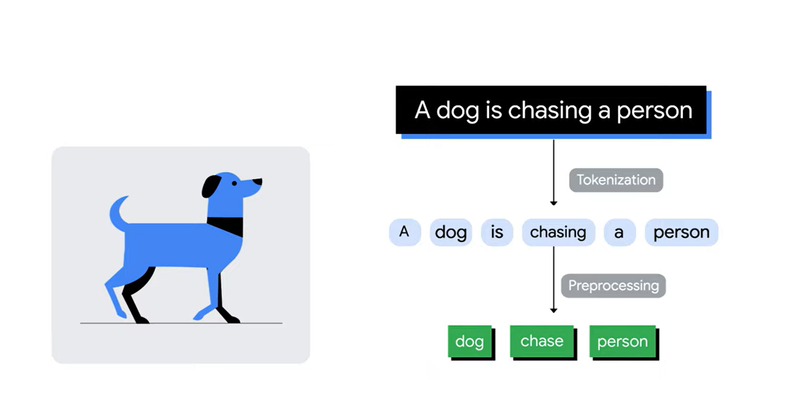
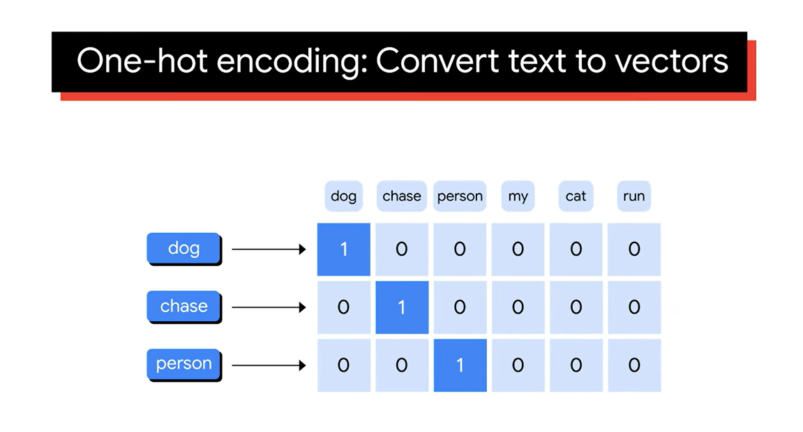
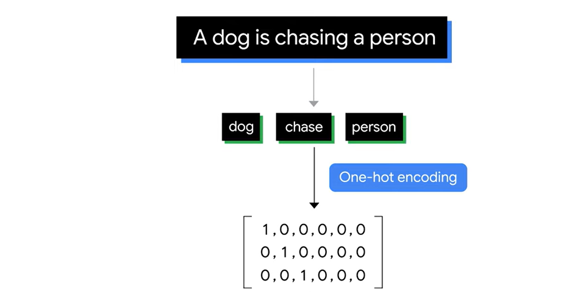

### 1. 什麼是嵌入
- 嵌入技術旨在將數據編碼為能夠捕捉語義意義的表示方式。
- 雖然多模態數據（例如文本、圖像、音頻、視頻和代碼）都可以轉換為向量嵌入，但這裡以文本嵌入為例。

### 2. 文本表示的挑戰
- 如何將文本轉換為保留意義的數字形式？
  - 數字應表示詞之間的關係，例如相似性和差異。
- 如何將文本轉換為可以用於機器學習模型的數字形式？
  - 機器學習模型通常需要相對稠密的矩陣或向量，過於稀疏的矩陣可能導致模型過擬合。

### 3. 文本表示技術
- **基本向量化技術**：如**一熱編碼（one-hot encoding）**
  - 將詞彙中的每個單詞進行一熱編碼。例如句子「一隻狗在追趕一個人」，經過分詞後可得到「狗」「追」「人」。
  - 生成的矩陣高維且稀疏，會導致計算浪費及模型過擬合。

### 4. 針對一熱編碼的問題(one-hot encoding)
- encode 成只有 0 與 1
- 不傳達詞之間的關係，無法辨認近似詞。
- 生成的矩陣維度依賴於詞彙表大小，可能會導致大量零值，形成超稀疏表示。

### 5. 嵌入技術的優勢
- **詞嵌入（Word Embeddings）**
  - 通過維度來描述單詞的屬性，並且字與字之間的距離表徵其語義相似性。
  - 例如，巴黎和東京之間的距離應與法國和日本之間的距離相似。

### 6. 如何生成詞嵌入
- 通過神經網絡訓練來自動學習這些嵌入的數值。
- 使用的算法和模型包括Google的Word2Vec、斯坦福的GloVe和Facebook的FastText。

### 7. 使用預訓練嵌入模型
- 可以調用API使用預訓練的嵌入模型，無需自己訓練神經網絡。
- 代碼示例展示了如何使用嵌入API，包括導入庫、指定模型名稱和定義文本輸入。

### 8. 其他媒體的嵌入
- 除了文本，還可以使用相同的方法將其他媒體（如圖像）轉換為嵌入，這樣文本和圖像可以在同一向量空間中相互靠近。

這些重點概述了嵌入的基本概念、技術、挑戰及其在機器學習中的應用。
