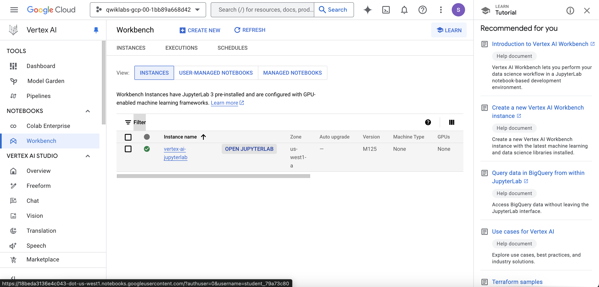
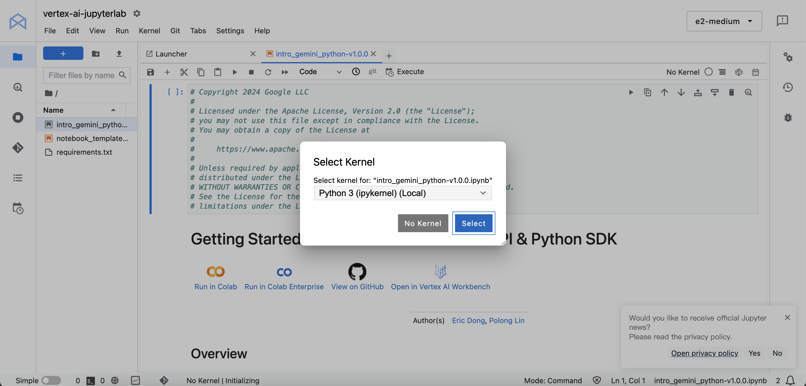
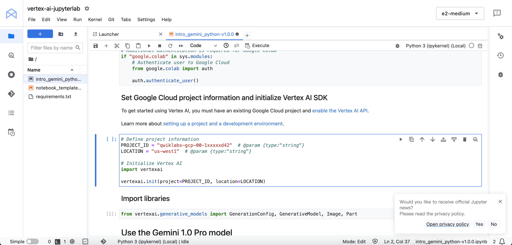

# Getting Started with the Vertex AI Gemini API and Python SDK

## Vertex AI Gemini API
The Vertex AI Gemini API provides a unified interface for interacting with Gemini models. There are currently two models available in the Gemini API:

- Gemini 1.0 Pro model (gemini-1.0-pro): Designed to handle natural language tasks, multi-turn text and code chat, and code generation.
- Gemini 1.0 Pro Vision model (gemini-1.0-pro-vision): Supports multimodal prompts. You can include text, images, and video in your prompt requests and get text or code responses.

interact with the Gemini API using the following methods:

- Use the Vertex AI Studio for quick testing and command generation
- Use cURL commands
- Use the Vertex AI SDK

## Objectives
In this lab, you will learn how to perform the following tasks:

- Install the Vertex AI SDK for Python
- Use the Gemini 1.0 Pro (gemini-1.0-pro) model to generate text
- Use the Gemini 1.0 Pro Vision (gemini-1.0-pro-vision) multimodal model to generate text from a combination of text, images, and video

## Task 1. Open the notebook in Vertex AI Workbench
Find the Workbench instance name instance and click on the Open JupyterLab button.

## Task 2. Set up the notebook

For Project ID, use Project ID, and for the Location, use Region

Install the libraries and 

## Task 3. Use the Gemini 1.0 Pro model
The Gemini 1.0 Pro (gemini-1.0-pro) model is designed to handle natural language tasks, multi-turn text and code chat, and code generation. In this task, run through the notebook cells to see how to use the Gemini 1.0 Pro model to generate text from text prompts.

- Generate text from text prompts
- print history

## Task 4. Use the Gemini 1.0 Pro Vision model
Gemini 1.0 Pro Vision (gemini-1.0-pro-vision) is a multimodal model that supports multimodal prompts

- Generate text from local image and text
- Generate text from text and image prompts
- Combining multiple images and text prompts for few-shot prompting

# conclusions
- understand differences between Gemini 1.0 Pro model and Gemini 1.0 Pro Vision model
