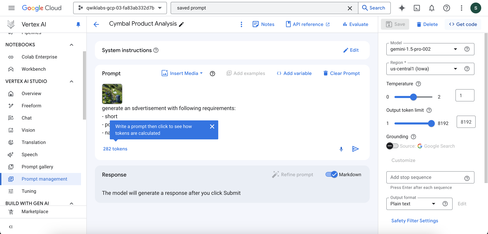
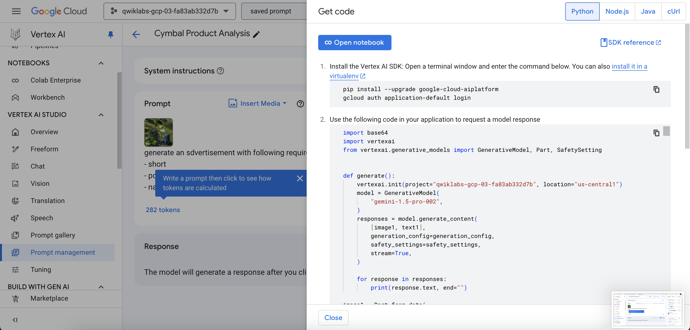
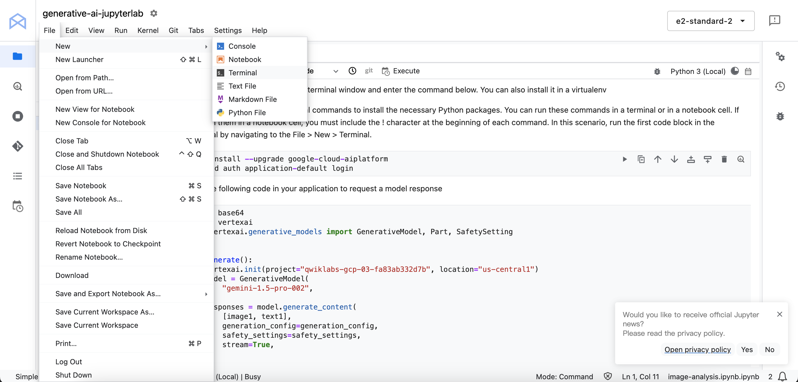
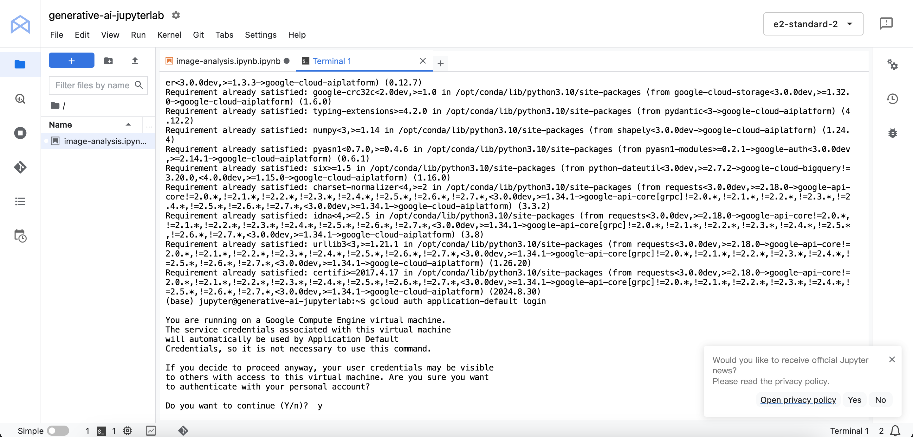
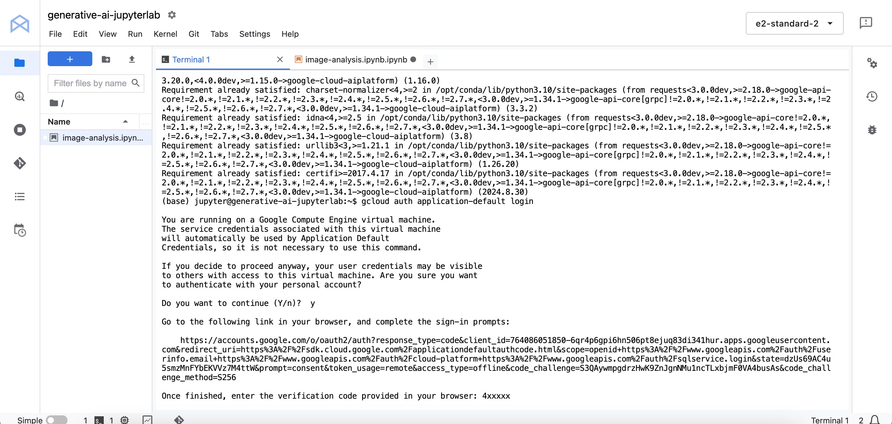

## Topics tested
Craft effective prompts and use parameters to guide generative AI output in Vertex AI Studio.
Apply Gemini models to create product descriptions and taglines in a real-world marketing scenario.
Examine and run Python code exported from Vertex AI Studio to gain a basic understanding of generative AI implementation.
Use Jupyter Notebooks to test and modify generative AI code.

## Tasks

### Task 1. Build a Gemini image analysis tool
create a template for analyzing images of Cymbal Direct products using the Gemini 1.5 Pro model in Vertex AI Studio. The goal is to generate descriptive text options inspired by the image, from simple details to more evocative, mood-setting phrases.

Use Vertex AI Studio's Freeform interface with the gemini-1.5-pro model to analyze Cymbal Direct's product image (provided) and generate multiple descriptive text options inspired by the image.

### Task 2. Build a Gemini tagline generator

### Task 3. Experiment with image analysis code

Explore the image analysis code by doing the following steps:
1. From the Vertex AI Studio page, navigate to the Saved Prompts page. Select the Cymbal Product Analysis prompt you created.
2. On the right side of the prompt, click Get Code. Use Python as the language.

Run the command in terminal

### Task 4. Experiment with tagline generation code

