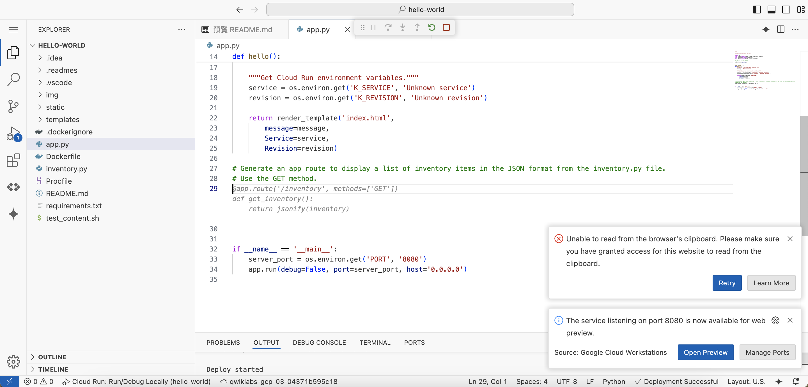

# Develop an app with Gemini

## Objectives
In this lab, you learn how to perform the following tasks:

1. Create a cloud-based application development environment by using Cloud Workstations.
2. Explore various Google services that you can use to deploy an app by asking Gemini context-based questions.
3. Prompt Gemini to provide templates that you can use to develop a basic app in Cloud Run.
4. Create, explore, and modify the app by using Gemini to explain and generate the code.
5. Run and test the app locally, and then deploy it to Google Cloud by using Gemini to generate the steps.

## Task
### Task 1. Configure your environment and account
To set your project ID and region environment variables, in Cloud Shell, run the following commands:
```
PROJECT_ID=$(gcloud config get-value project)
REGION=us-east4
echo "PROJECT_ID=${PROJECT_ID}"
echo "REGION=${REGION}"
```


To store the signed-in Google user account in an environment variable, run the following command:
```
USER=$(gcloud config get-value account 2> /dev/null)
echo "USER=${USER}"
```

Enable the Cloud AI Companion API for Gemini:
```
gcloud services enable cloudaicompanion.googleapis.com --project ${PROJECT_ID}
```

To use Gemini, grant the necessary IAM roles to your Google Cloud Qwiklabs user account:
```
gcloud projects add-iam-policy-binding ${PROJECT_ID} --member user:${USER} --role=roles/cloudaicompanion.user
gcloud projects add-iam-policy-binding ${PROJECT_ID} --member user:${USER} --role=roles/serviceusage.serviceUsageViewer
```


### Task 2. Create a Cloud Workstation
#### Create a workstation configuration


#### Create a workstation


#### Launch the IDE
##### set allow cookie


### Task 3. Update the Cloud Code extension to enable Gemini


### Task 4. Chat with Gemini
#### Connect to Google Cloud


#### Enable Gemini in Cloud Code


#### chat to Gemini


### Task 5. Develop a Python app
#### Create a Python app by using the steps from Gemini


#### Explore the app with Gemini


#### Run the app locally


### Task 6. Enhance the Python app
#### Generate sample data using Gemini


#### Add the GET /inventory list API method to the app


```py
from flask import Flask, render_template, jsonify
from inventory import inventory
```




#### Add the GET /inventory/{productID} method to the app


#### Rebuild and redeploy the app locally
You can run your app locally from your IDE using the Cloud Run emulator. In this case, locally means on the workstation machine.

1. In the activity bar of your IDE, click Cloud Code (Code OSS Cloud Code menu).
2. In the Cloud Run activity bar, click Run App on Local Cloud Run Emulator (Cloud Run - run on local emulator).
3. When prompted at the top of the screen to Enable minikube gcp-auth addon to access Google APIs, select Yes.


#### Test the API methods


### Task 7. Deploy the app to Cloud Run


To get the URL for the Cloud Run service inventory page, in Cloud Shell, run the following command:
```
export SVC_URL=$(gcloud run services describe hello-world \
  --project set at lab start \
  --region set at lab start \
  --platform managed \
  --format='value(status.url)')
echo ${SVC_URL}/inventory
```


